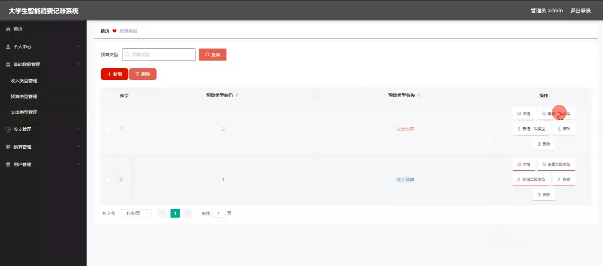
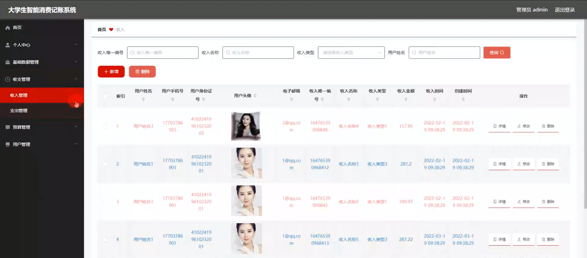
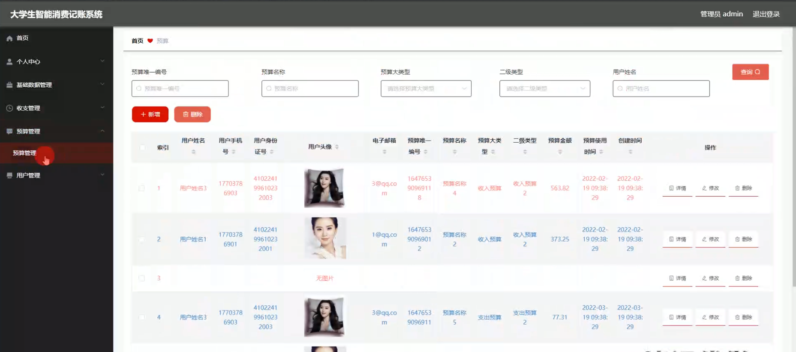
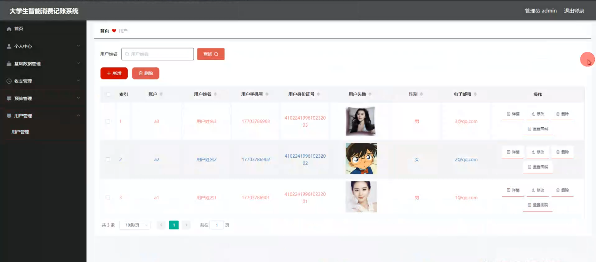
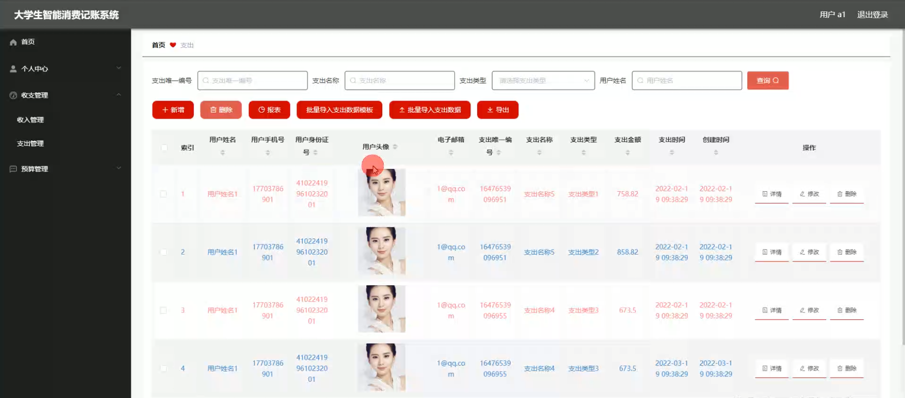

# 毕业设计-基于Java的大学生智能消费记账系统

---
### 👉作者QQ ：1556708905 微信：zheng0123Long (支持定制修改、部署调试、定制毕设)

### 👉接网站建设、小程序、H5、APP、各种系统等

---

#### 介绍

大学生智能消费记账系统是一个基于Java开发的应用程序，旨在帮助大学生更好地管理和记录他们的日常收支情况。随着移动支付和电子商务的普及，大学生的消费行为变得更加复杂和多样化，这对他们的财务管理提出了新的挑战。传统的手工记账方式效率低下且容易出错，而智能消费记账系统则通过自动化和数据分析技术，为大学生提供了一个高效、便捷和智能的财务管理工具。

#### 研究背景

近年来，大学生的消费水平和消费结构发生了显著变化，许多学生缺乏有效的财务管理意识，容易陷入财务困境。此外，随着技术的进步，智能化和自动化的应用在各个领域中变得越来越普遍。然而，市场上针对大学生群体的智能记账工具较少，无法充分满足他们的需求。因此，开发一个专门针对大学生的智能消费记账系统显得尤为重要。

#### 技术栈

后端技术栈：Springboot+Mysql+Maven

前端技术栈：Vue+Html+Css+Javascript+ElementUI

开发工具：Idea+Vscode+Navicate

#### 系统功能介绍

管理员角色
个人中心：

个人信息管理：管理员可以查看和修改个人信息，包括姓名、联系方式等。  
密码管理：管理员可以修改登录密码，以保障账户安全。
基础数据管理：

类别管理：管理员可以添加、删除和修改收入和支出的类别，例如餐饮、购物、学习等。  
数据导入/导出：管理员可以将历史数据导入系统或将系统数据导出为Excel等格式，便于备份和分析。  

收支管理：
收入管理：管理员可以记录和管理各类收入信息，包括收入来源、金额、日期等。    
支出管理：管理员可以记录和管理各类支出信息，包括支出项目、金额、日期等。    
数据统计与分析：提供图表和报表功能，帮助管理员分析收入和支出的分布和趋势。  
预算管理：

预算设置：管理员可以根据不同的收入和支出类别设置月度或年度预算，帮助学生合理规划财务。  
预算监控：实时监控预算执行情况，及时预警超支行为。  

用户管理：

用户账户管理：管理员可以添加、删除和管理用户账户，分配相应的权限。  
用户活动监控：管理员可以查看用户的活动记录，了解其使用情况和财务状况。  

用户角色
个人中心：  
个人信息管理：用户可以查看和修改个人信息，包括姓名、联系方式等。  
密码管理：用户可以修改登录密码，以保障账户安全。  
收支管理：  
收入管理：用户可以记录和管理个人的收入信息，包括收入来源、金额、日期等。  
支出管理：用户可以记录和管理个人的支出信息，包括支出项目、金额、日期等。  
数据统计与分析：提供图表和报表功能，帮助用户分析个人的收入和支出情况。  

预算管理：  
预算设置：用户可以根据个人的收入和支出情况设置月度或年度预算，帮助合理规划财务。  
预算监控：实时监控预算执行情况，及时预警超支行为。  

#### 系统作用

大学生智能消费记账系统的主要作用在于提升大学生的财务管理能力，帮助他们养成良好的消费习惯。通过系统的使用，学生可以：

全面了解个人财务状况：通过系统记录和分析个人的收入和支出情况，学生可以全面了解自己的财务状况，发现消费习惯中的问题和改进空间。  
合理规划预算：通过预算管理功能，学生可以根据实际情况制定合理的预算，避免不必要的开支，培养节约意识。  
数据分析与决策支持：系统提供的数据统计和分析功能，可以帮助学生了解消费趋势和分布，为他们的财务决策提供科学依据。  
提高财务安全性：通过用户和管理员角色的分工和权限管理，保障系统数据的安全性和私密性，防止财务信息泄露。  

#### 系统功能截图

登录界面

基础数据管理

收入管理

预算管理

用户管理

支出管理

#### 总结

大学生智能消费记账系统的开发不仅填补了市场上针对大学生群体的智能记账工具的空白，还为提升大学生的财务管理能力提供了有力支持。系统通过提供全面、便捷和智能化的功能，帮助大学生更好地管理他们的日常收支，培养良好的消费习惯和财务规划意识。然而，系统的使用仍面临一些挑战，如用户的使用习惯和数据的隐私保护等问题，需要在后续的开发和运营中不断改进和完善。

总的来说，大学生智能消费记账系统是一款具有重要意义和广泛应用前景的工具，它不仅帮助大学生提升财务管理能力，还为他们的未来财务健康奠定了坚实基础。

#### 使用说明

创建数据库，执行数据库脚本 修改jdbc数据库连接参数 下载安装maven依赖jar 启动idea中的springboot项目
